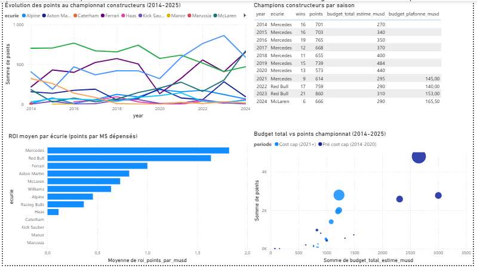

# L'économie de la performance en Formule 1

Projet d'analyse de données explorant le lien entre le budget des écuries de Formule 1 et leurs résultats sportifs sur la période 2014-2024, avec un focus particulier sur l'impact du plafond budgétaire (cost cap) instauré en 2021.

## Question centrale

> *Dans la F1 moderne, l'argent achète-t-il vraiment la victoire, et le plafond budgétaire instauré en 2021 a-t-il changé la donne ?*

## Aperçu du dashboard

Le dashboard est également disponible au format interactif (`f1_economics_dashboard.pbix`) et en PDF dans le dossier `powerbi/`.

## Principaux enseignements

À partir de 11 saisons analysées (2014-2024) et 109 lignes budget-écurie consolidées :

**1. Avant 2021, l'argent achetait largement la performance.** Les écuries du top 3 (Mercedes, Ferrari, Red Bull) dépensaient entre 280 et 484 millions de dollars par saison, contre 75 à 150 millions pour les fonds de grille. Cet écart de 1 à 5 se retrouvait directement au classement constructeurs.

**2. Le cost cap a resserré la dispersion budgétaire.** À partir de 2021, les budgets soumis au plafond convergent autour de 145-170 M$ pour toutes les écuries. Le visuel "Budget vs Points" montre une bande verticale beaucoup plus étroite après 2021 que sur la période 2014-2020.

**3. La hiérarchie sportive devient plus mobile.** Mercedes a dominé sept saisons consécutives (2014-2020), puis Red Bull a pris le relais (2021-2023), suivi par McLaren champion en 2024. Une rotation impossible avant le cost cap.

**4. Le ROI raconte une histoire différente du classement.** Sur la période complète, Mercedes affiche le meilleur rendement points/M$ (1,79), suivi de Red Bull (1,56) et Ferrari (1,17). Aston Martin (0,96) surperforme sa réputation, alors que Williams (0,61) sous-performe sur le long terme malgré son glorieux passé.

## Méthodologie

### Périmètre

- 11 saisons : 2014 à 2024 (résultats sportifs)
- Données budgétaires couvrant 2014-2025
- 2014 marque le début de l'ère hybride (rupture technique majeure)
- 2021 marque l'instauration du plafond budgétaire (cost cap)

### Sources de données

**Données sportives** : dataset Kaggle *Formula 1 World Championship 1950-2024* (Rohan Rao). Couvre les résultats par course, classements constructeurs, qualifications, écuries.

**Données budgétaires** : dataset construit manuellement à partir de plusieurs sources :
- Articles RaceFans *The cost of F1* (2018, 2019)
- Rapports de compliance FIA sur le cost cap (2021-2024)
- Forbes *Most Valuable F1 Teams* (2025)
- Document de synthèse de recherche personnelle (`sources/budgets-f1-plafond-et-ecuries.pdf`)

Chaque ligne du fichier `data/budgets_ecuries.csv` indique sa **source principale** et son **niveau de fiabilité** (HAUTE, MOYENNE, FAIBLE), pour une traçabilité complète.

### Pipeline de traitement

1. **Exploration** des 14 fichiers Kaggle dans le notebook `01_exploration.ipynb`
2. **Filtrage temporel** : restriction à la période 2014+
3. **Calcul des classements finaux** : agrégation des `constructor_standings` par dernière course de chaque saison
4. **Harmonisation des noms d'écuries** : table de correspondance pour gérer les changements de nom (Lotus → Renault → Alpine, Force India → Racing Point → Aston Martin, etc.)
5. **Jointure budget × résultats** sur la clé (saison, écurie)
6. **Calcul des métriques dérivées** : ROI (points par M$), flag de période (pré/post cost cap)
7. **Export du dataset analytique** consommé par Power BI

## Structure du projet

Le projet est organisé en quatre dossiers. `data/` contient à la fois les fichiers Kaggle bruts, le dataset budgets construit manuellement (`budgets_ecuries.csv`) et le dataset analytique final consommé par Power BI (`dataset_analytique.csv`). Le notebook Python `notebooks/01_exploration.ipynb` documente tout le pipeline ETL. Le dashboard est dans `powerbi/` (fichier `.pbix` éditable + export PDF). Les sources documentaires (rapports FIA, synthèse de recherche) sont dans `sources/`.

## Technologies utilisées

- **Python 3.11** avec pandas pour l'ETL et l'exploration
- **JupyterLab** pour les notebooks
- **Power BI Desktop** pour la visualisation et le dashboard final
- **Git / GitHub** pour le versioning et la publication

## Avertissements méthodologiques

Trois limites importantes à connaître en lisant ce projet.

**Fiabilité des budgets pré-2021.** Avant le cost cap, les écuries ne publiaient pas leurs comptes. Toutes les valeurs antérieures à 2021 sont des estimations journalistiques (RaceFans principalement). La colonne `fiabilite` du fichier budgets indique le niveau de confiance de chaque ligne.

**Distinction budget plafonné vs budget total.** Depuis 2021, la FIA limite seulement certaines catégories de dépenses. Le budget total inclut les salaires des pilotes, les salaires des trois dirigeants les mieux payés, le marketing et les déplacements, qui ne sont pas plafonnés. Le dataset distingue explicitement les deux notions (`budget_plafonne_musd` et `budget_total_estime_musd`).

**Couverture temporelle asymétrique.** Le dataset Kaggle des résultats sportifs s'arrête à la fin 2024. Les données budgétaires 2025 sont présentes dans `budgets_ecuries.csv` mais ne sont pas exploitées dans le dashboard final faute de résultats sportifs correspondants. Une mise à jour avec l'API Ergast/Jolpica est prévue.

## Continuité des écuries

Plusieurs écuries ont changé de nom suite à des rachats. Le dataset utilise le **nom canonique actuel** dans la colonne `ecurie`, et conserve le **nom historique** dans la colonne `nom_historique` pour traçabilité.

| Nom actuel | Historique |
|---|---|
| Alpine | Lotus F1 (2014-2015) → Renault (2016-2020) → Alpine (2021+) |
| Aston Martin | Force India (2014-2018) → Racing Point (2018-2020) → Aston Martin (2021+) |
| Racing Bulls | Toro Rosso (2014-2019) → AlphaTauri (2020-2023) → RB (2024) → Racing Bulls (2025) |
| Kick Sauber | Sauber (2014-2018) → Alfa Romeo (2019-2023) → Kick Sauber (2024-2025) |

## À propos

Projet portfolio réalisé dans le cadre de ma formation en Data Analyse. Premier projet d'une série visant à démontrer la maîtrise du cycle complet d'un projet data : cadrage business, collecte de sources hétérogènes, ETL Python, modélisation et restitution Power BI.

**Prochain projet** : application de techniques de Machine Learning à la prédiction des résultats de Formule 1.
